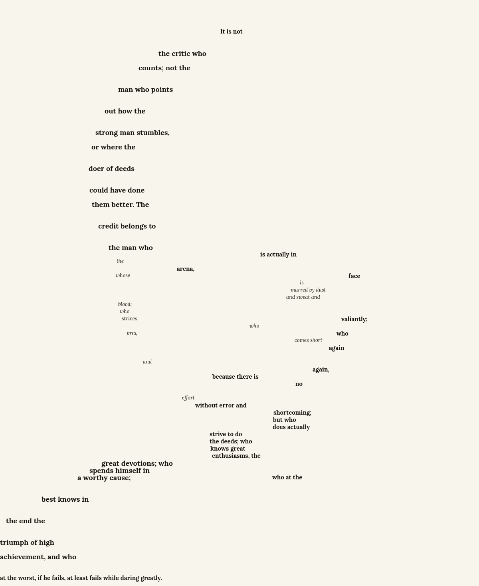
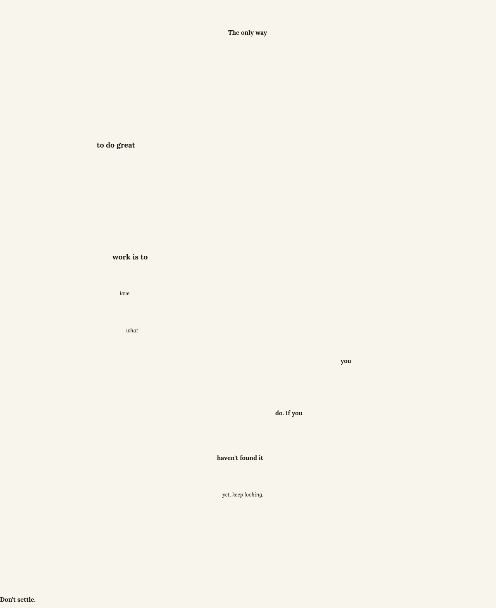
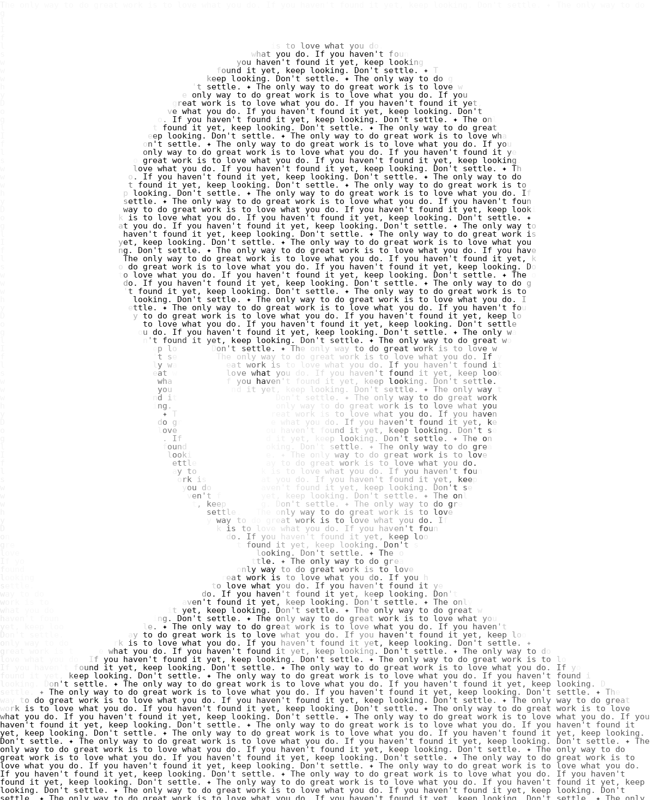

# QuoteImage

Turns a portrait photo + a quote into a black-and-white typographic portrait.

## Browser app

`web/index.html` is a self-contained, no-install web app — everything (image
processing, text layout, rendering) runs client-side in JavaScript on a
`<canvas>`, so your photo never leaves the browser. Just open the file in
Chrome:

```bash
open web/index.html          # macOS
xdg-open web/index.html      # Linux
# or just double-click the file / drag it into a Chrome tab
```

Upload a photo, paste a quote, and it renders live.

The quote is set **once, in full** — never repeated — using an embedded
serif typeface (Lora). The photo is reduced to a handful of tonal bands via
Otsu thresholding; each band maps to a weight and style (light italic for
soft shading, bold for the darkest hair/shadow/contour regions), so the
words' own boldness and size stand in for the photo's light and dark. A
solver picks the largest comfortable type size at which the *entire* quote
still fits somewhere on the portrait's shape — shrinking only as far as
genuinely necessary — and short quotes are spread across the portrait's
most defining regions (rather than repeating or clumping) so they still
reach across the whole image. A quote is never truncated: if a photo's
shape genuinely can't hold it at a legible size, the remainder wraps as a
plain line rather than being cut off.

Controls: output width, contrast, tonal curve, edge emphasis, shading
balance (nudges the tone/background cutoff), and light-text-on-dark-ground
invert — plus a "Download PNG" button.

A longer quote gives the solver more to work with and traces the shape more
fully:



A short quote still spreads across the portrait's most defining regions,
just more sparsely:



## Command line

A separate, simpler command-line tool (`quoteimage/portrait.py`) is also
included — it tiles the quote repeatedly across the image, shaded by
brightness, rather than the browser app's single-pass/weighted-type
approach above.



## Setup

```bash
pip install -r requirements.txt
```

Needs a monospace TrueType font on the system (DejaVu Sans Mono, Liberation
Mono, or FreeMono are auto-detected); pass `--font /path/to/font.ttf` if
none of those are installed.

## Usage

```bash
python3 -m quoteimage.portrait photo.jpg "Your quote here." -o portrait.png
```

Or read a long quote (with attribution) from a file:

```bash
python3 -m quoteimage.portrait photo.jpg --quote-file quote.txt -o portrait.png
```

### Key options

| Flag | Default | Effect |
|---|---|---|
| `--width` | 1400 | Output width in pixels (height follows the photo's aspect ratio). |
| `--cell-size` | 15 | Font size / row height. Smaller = more detail, finer text. |
| `--contrast` | 1.35 | Contrast boost on the source photo before mapping to ink. |
| `--gamma` | 0.85 | <1 darkens midtones (bolder, more visible text); >1 lightens them. |
| `--edge-boost` | 90 | How strongly edges (eyes, nose, jaw outline) are darkened for recognizability. Set to `0` to disable. |
| `--white-threshold` | 248 | Brightness above which no glyph is drawn, keeping highlights crisp white. |
| `--mode` | `grayscale` | `grayscale` shades each glyph by local brightness (best likeness). `dither` uses error diffusion for a pure black/white (no gray) result. |
| `--invert` | off | Light subject on a dark/black background instead of dark-on-white. |

Run `python3 -m quoteimage.portrait --help` for the full list.

## How it works

1. The photo is loaded, auto-contrasted, and converted to grayscale.
2. An edge map (Pillow's `FIND_EDGES`) is blended in so facial contours stay
   crisp even in flatter-toned areas.
3. The quote is split into words and repeated indefinitely (looping quotes
   are separated with `✦`), then greedily word-wrapped into text lines that
   fill the image, just like a paragraph.
4. For every glyph, the script samples the average brightness of the photo
   pixels directly beneath it and uses that to pick the glyph's gray level
   (or, in `--mode dither`, whether to draw it at all, via 1-D error
   diffusion along each line).
5. The result is saved as a flattened grayscale PNG.

## Tuning tips

- **Faces looking muddy/unrecognizable:** raise `--edge-boost` and/or lower
  `--gamma` (e.g. `0.7`) to punch up contrast.
- **Text hard to read:** raise `--cell-size` (bigger glyphs) or lower
  `--contrast`/raise `--white-threshold` so fewer glyphs render at heavy ink.
- **Want a poster-style pure black/white look:** use `--mode dither`.
- For best results use a well-lit, front-facing portrait with a plain
  background and good separation between the subject and background
  brightness.

## Try it without a real photo

`examples/make_sample_portrait.py` draws a synthetic face you can use to
sanity-check the pipeline:

```bash
python3 examples/make_sample_portrait.py
python3 -m quoteimage.portrait examples/sample_portrait.png \
  "The only way to do great work is to love what you do." \
  -o examples/cli_example.png
```
